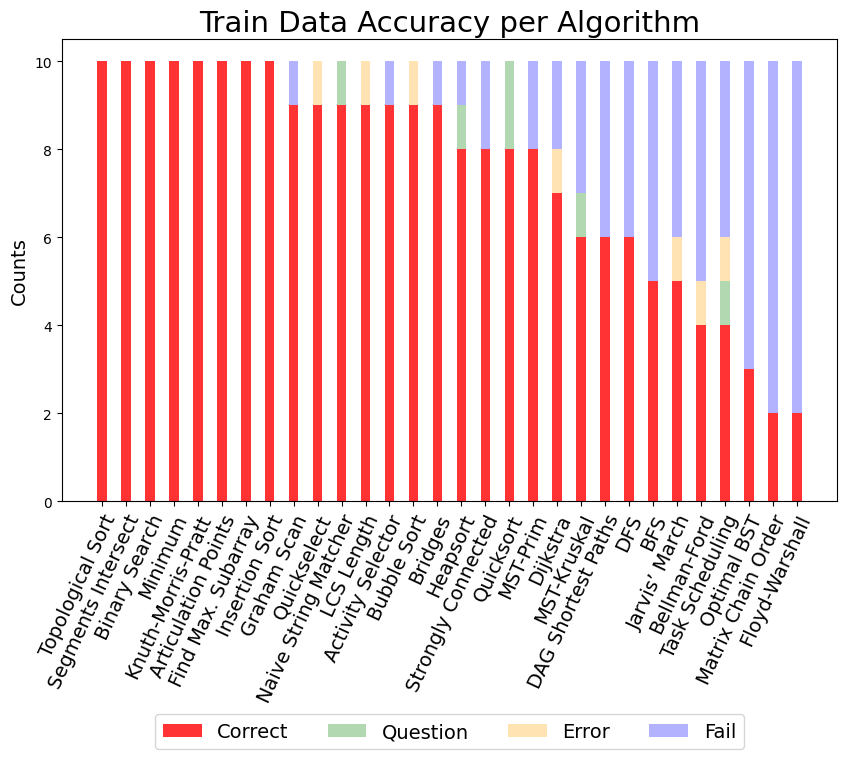
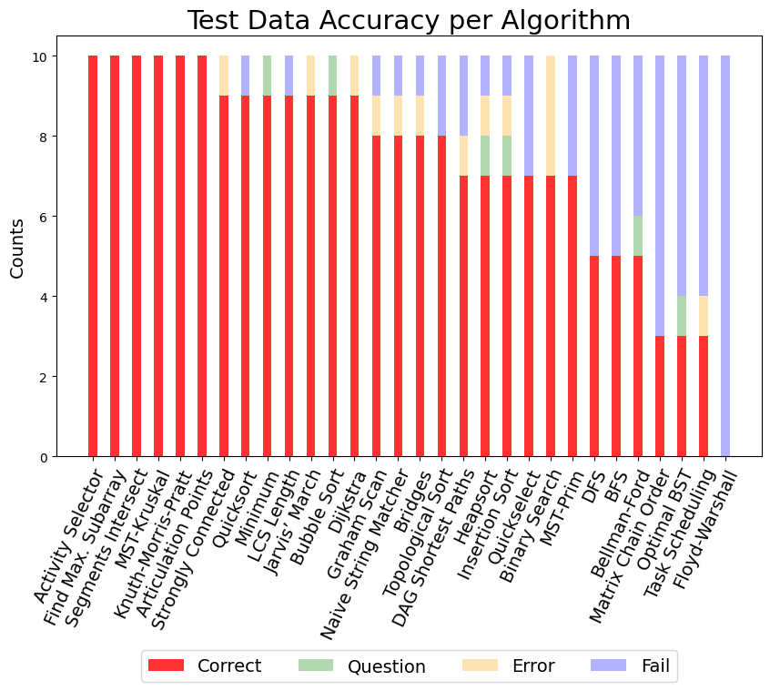
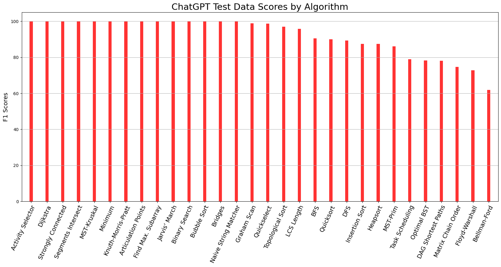
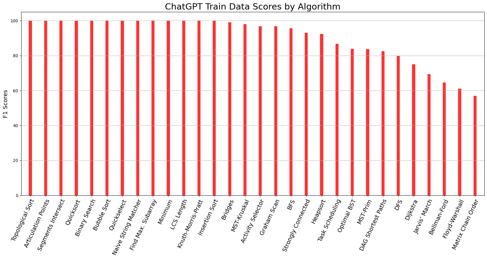
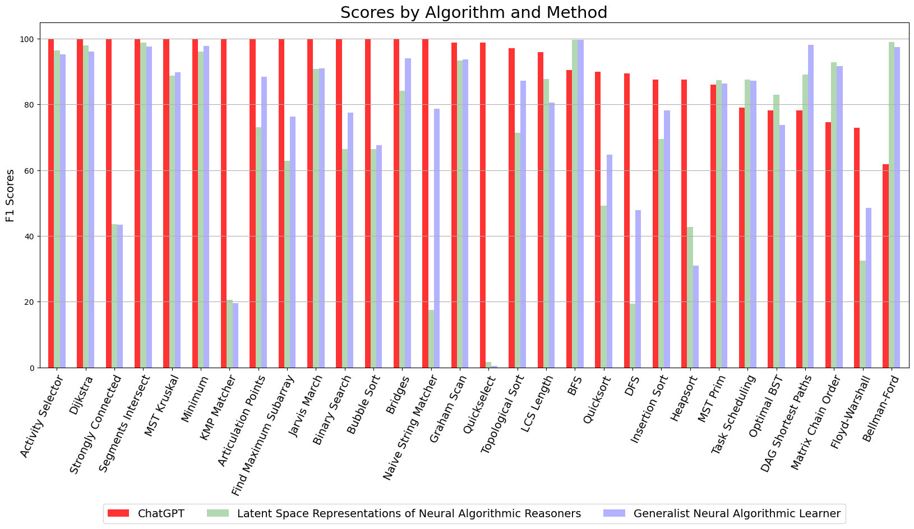

# LLM CLRS

## Individual Accuracy
<figure>
  
  <figcaption style="text-align: center;">Individual Train 0-1 Accuracy Scores for ChatGPT</figcaption>
</figure>

<figure>
  
  <figcaption style="text-align: center;">Individual Test 0-1 Accuracy Scores for ChatGPT</figcaption>
</figure>

## Individual F1
<figure>
  
  <figcaption style="text-align: center;">Individual Test F1 Scores for ChatGPT</figcaption>
</figure>

<figure>
  
  <figcaption style="text-align: center;">Individual Train F1 Scores for ChatGPT</figcaption>
</figure>

## Comparison F1
<figure>
  
  <figcaption style="text-align: center;">Comparison of Test F1 Scores to ChatGPT</figcaption>
</figure>