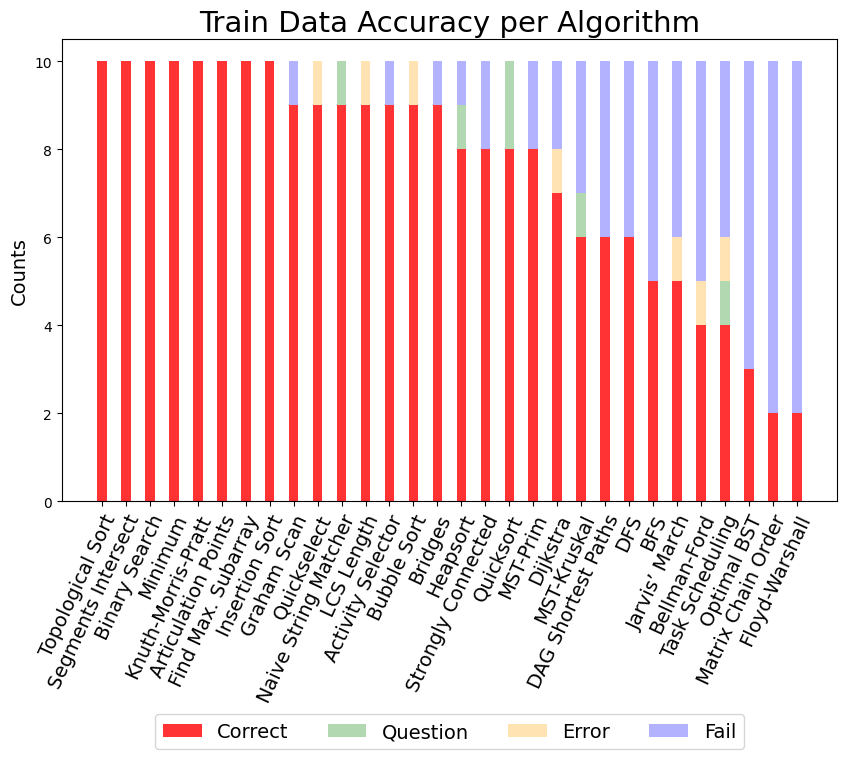
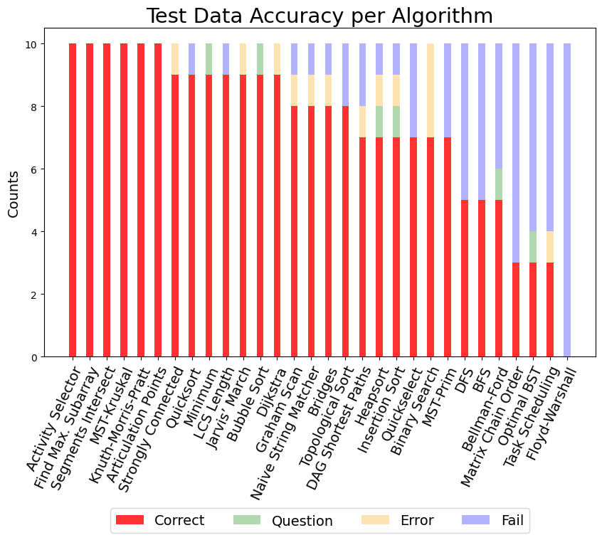
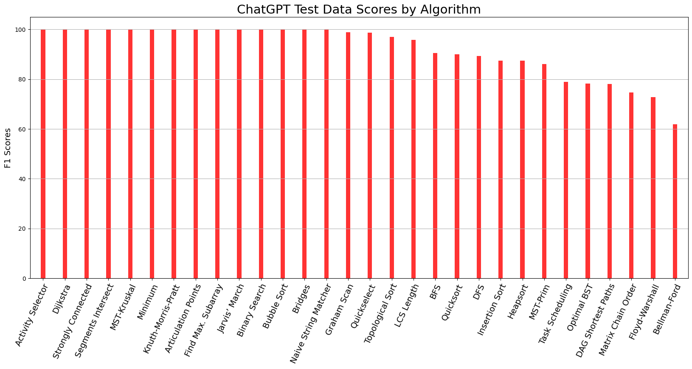
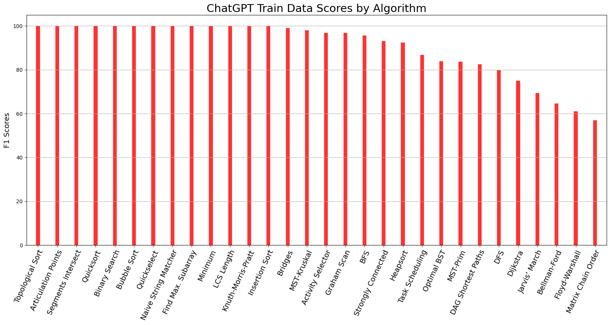
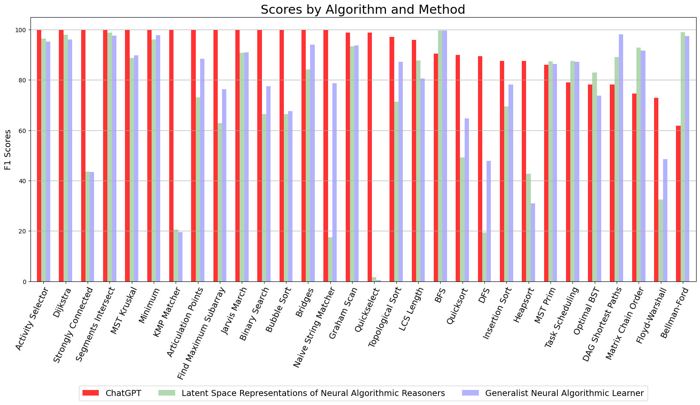

# Individual Accuracy

<  <figure>
    
    <figcaption style="text-align: center;">Individual Train 0-1 Accuracy Scores for ChatGPT</figcaption>
  </figure>

  <figure>
    
    <figcaption style="text-align: center;">Individual Test 0-1 Accuracy Scores for ChatGPT</figcaption>
  </figure>

# Individual F1

  <figure>
    
    <figcaption style="text-align: center;">Individual Train F1 Scores for ChatGPT</figcaption>
  </figure>

  <figure>
    
    <figcaption style="text-align: center;">Individual Test F1 Scores for ChatGPT</figcaption>
  </figure>

# Comparison F1

 
  <figure>
    
    <figcaption style="text-align: center;">Comparison of Test F1 Scores to ChatGPT</figcaption>
  </figure>

<!-- <figure>
  
  <figcaption style="text-align: center;">Individual Train 0-1 Accuracy Scores for ChatGPT</figcaption>
</figure>

 <figure>
  
  <figcaption style="text-align: center;">Individual Test 0-1 Accuracy Scores for ChatGPT</figcaption>
</figure> -->

<!-- # Individual F1 -- added just images 3/
<figure>
  
  <figcaption style="text-align: center;">Individual Test F1 Scores for ChatGPT</figcaption>
</figure>

<figure>
  
  <figcaption style="text-align: center;">Individual Train F1 Scores for ChatGPT</figcaption>
</figure> -->

<!-- # Comparison F1
<figure>
  
  <figcaption style="text-align: center;">Comparison of Test F1 Scores to ChatGPT</figcaption>
</figure>   -->
